# 《 实验三：聚合操作练习》


> 学院：省级示范性软件学院
> 课程：高级数据库技术与应用
> 题目：《 实验三：聚合操作练习》
> 姓名：李穗杰
> 学号：1977000019
> 班级：软工2201
> 日期：2024-10-12
> 实验环境： elasticsearch-8.12.2、apifox
> 实验目的：熟练掌握Elasticsearch 聚合操作
> 实验内容：Elasticsearch 聚合操作练习

## 前期准备

### 1.创建索引

```
{
  "mappings": {
    "properties": {
      "order_id": { "type": "keyword" },
      "order_date": { "type": "date" },
      "customer_id": { "type": "keyword" },
      "customer_name": { "type": "keyword" },
      "customer_gender": { "type": "keyword" },
      "customer_age": { "type": "integer" },
      "customer_city": { "type": "keyword" },
      "product_id": { "type": "keyword" },
      "product_name": { "type": "keyword" },
      "product_category": { "type": "keyword" },
      "quantity": { "type": "integer" },
      "price": { "type": "float" },
      "total_amount": { "type": "float" },
      "payment_method": { "type": "keyword" },
      "is_returned": { "type": "boolean" }
    }
  }
}
```

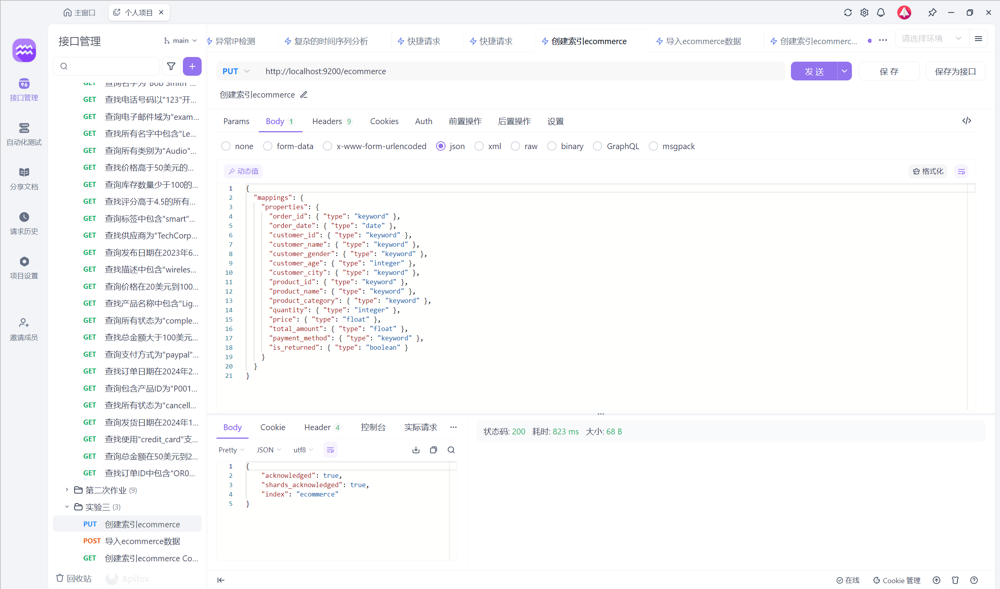

### 2.导入数据

用post http://localhost:9200/ecommerce/_bulk

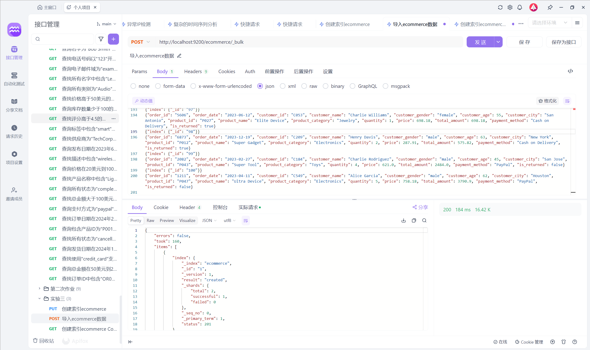


## 作业内容

### 1.统计每个产品类别的总销售额。

  ```
  {
    "size": 0, 
    "aggs": {
   "sales_by_category": {
     "terms": {
       "field": "product_category",
       "size": 10
     },
     "aggs": {
       "total_sales": {
         "sum": {
           "field": "total_amount"
         }
       }
     }
   }
    }
  }
  ```

  size: 0：表示不返回任何具体文档，只返回聚合结果。
  terms：基于 product_category 字段进行分组。
  sum：对每个类别的 total_amount 求和。
  

### 2.计算每个城市的平均订单金额。

  ```
  {
    "size": 0,
    "aggs": {
   "avg_order_amount_by_city": {
     "terms": {
       "field": "customer_city",
       "size": 10
     },
     "aggs": {
       "average_order_amount": {
         "avg": {
           "field": "total_amount"
         }
       }
     }
   }
    }
  }
  ```

  size: 0：我们不需要返回文档，只需要聚合结果。
  terms：按 customer_city 字段分组。
  avg：对每个城市的 total_amount 字段计算平均值。
  

### 3.找出销量最高的前5个产品。

  ```
  {
    "size": 0,
    "aggs": {
   "top_5_products_by_sales": {
     "terms": {
       "field": "product_name",    // 按产品名称分组
       "order": {
         "total_sales": "desc"     // 按销量总和降序排列
       },
       "size": 5                   // 限制返回前5个
     },
     "aggs": {
       "total_sales": {
         "sum": {
           "field": "quantity"     // 对销量字段求和
         }
       }
     }
   }
    }
  }
  ```

  size: 0：表示不返回具体的文档，只返回聚合结果。
  terms 聚合：按 product_name 字段对产品进行分组。
  order：通过 total_sales（销量总和）降序排列产品。
  sum 聚合：对每个产品的 quantity（销量）进行求和。
  size: 5：限制返回前 5 个产品。
  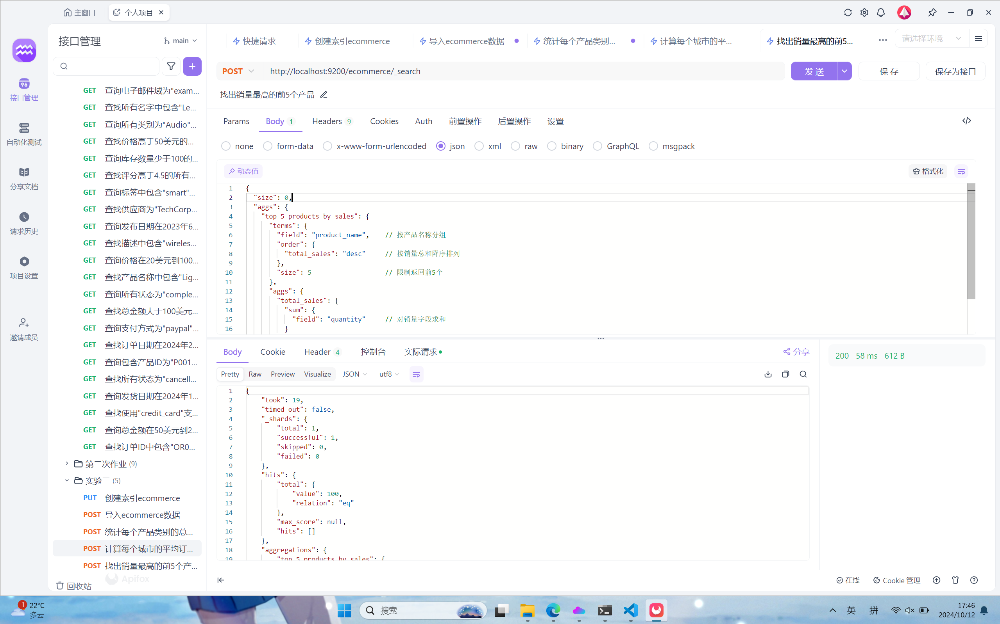

### 4.计算男性和女性客户的平均年龄。

  ```
  {
    "size": 0,
    "aggs": {
   "average_age_by_gender": {
     "terms": {
       "field": "customer_gender",  // 按性别分组
       "size": 2                    // 限制返回两个性别
     },
     "aggs": {
       "average_age": {
         "avg": {
           "field": "customer_age"  // 计算平均年龄
         }
       }
     }
   }
    }
  }
  ```

  size: 0：表示不返回具体的文档，只返回聚合结果。
  terms 聚合：按 customer_gender 字段对客户进行分组（例如：男性和女性）。
  avg 聚合：对每个性别的 customer_age 字段计算平均值。
  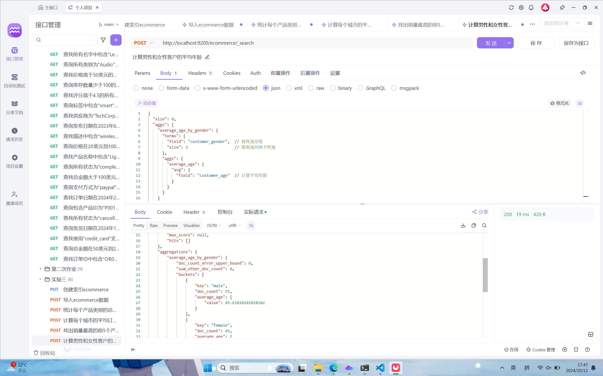

### 5.统计每种支付方式的使用次数和总金额。

  ```
  {
    "size": 0,
    "aggs": {
   "payment_method_stats": {
     "terms": {
       "field": "payment_method", // 按支付方式分组
       "size": 10 // 限制返回的支付方式数量
     },
     "aggs": {
       "usage_count": {
         "value_count": {
           "field": "order_id" // 计算每种支付方式的使用次数
         }
       },
       "total_amount": {
         "sum": {
           "field": "total_amount" // 计算每种支付方式的总金额
         }
       }
     }
   }
    }
  }
  ```

  size: 0：表示不返回具体的文档，只返回聚合结果。
  terms 聚合：按 payment_method 字段对支付方式进行分组。
  value_count 聚合：计算每种支付方式的使用次数（使用 order_id 字段进行计数）。
  sum 聚合：计算每种支付方式的 total_amount 字段的总和。
  

### 6.计算每月的总销售额。

  ```
  {
    "size": 0,
    "aggs": {
   "monthly_sales": {
     "date_histogram": {
       "field": "order_date", // 按照订单日期分组
       "calendar_interval": "month", // 按月分组
       "format": "yyyy-MM" // 设置日期格式
     },
     "aggs": {
       "total_sales": {
         "sum": {
           "field": "total_amount" // 计算每月的总销售额
         }
       }
     }
   }
    }
  }
  ```

  size: 0：表示不返回具体的文档，只返回聚合结果。
  date_histogram 聚合：按照 order_date 字段按月分组。
  calendar_interval: "month"：指定按月聚合。
  format: "yyyy-MM"：设置输出的日期格式为年-月。
  sum 聚合：计算每个月的 total_amount 字段的总和。
  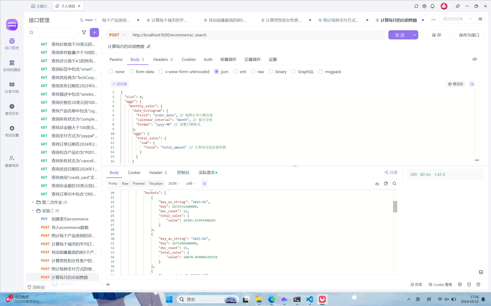

### 7.找出平均订单金额最高的前3个客户。

  ```
  {
    "size": 0,
    "aggs": {
   "top_customers": {
     "terms": {
       "field": "customer_id", // 按客户ID分组
       "size": 3 // 返回前3个客户
     },
     "aggs": {
       "average_order_amount": {
         "avg": {
           "field": "total_amount" // 计算平均订单金额
         }
       }
     }
   }
    }
  }
  ```

  size: 0：表示不返回具体的文档，只返回聚合结果。
  terms 聚合：根据 customer_id 字段分组。
  size: 3：限制结果为前3个客户。
  avg 聚合：计算每个客户的 total_amount 字段的平均值。
  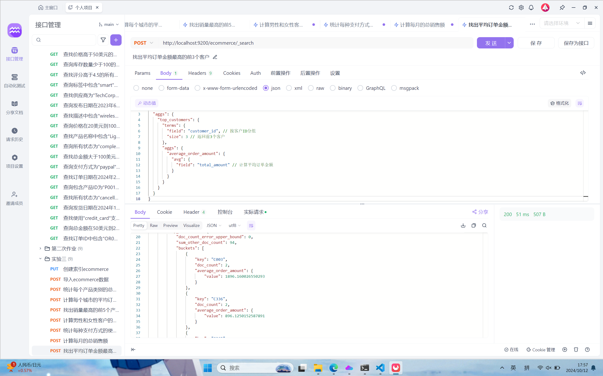

### 8.计算每个年龄段（18-30，31-50，51+）的客户数量。

  ```
  {
    "size": 0,
    "aggs": {
   "age_ranges": {
     "range": {
       "field": "customer_age", // 按客户年龄字段进行分组
       "ranges": [
         { "to": 30, "key": "18-30" }, // 18-30岁
         { "from": 31, "to": 50, "key": "31-50" }, // 31-50岁
         { "from": 51, "key": "51+" } // 51岁及以上
       ]
     }
   }
    }
  }
  ```

  size: 0：表示不返回具体的文档，只返回聚合结果。
  range 聚合：根据 customer_age 字段的值将客户划分到不同的年龄段。
  ranges：定义每个年龄段的范围和对应的标签（key）。
  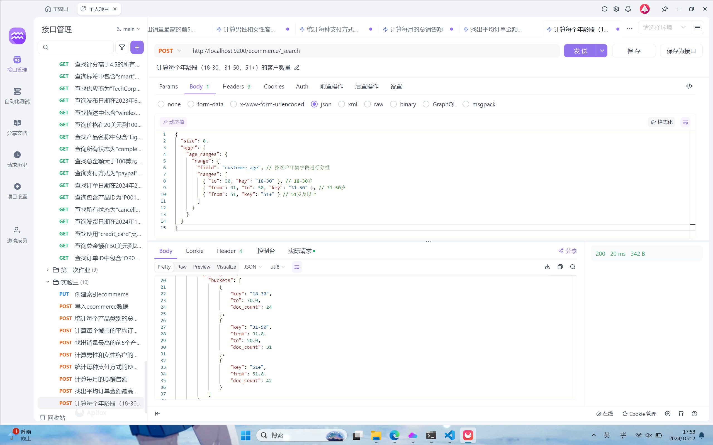

### 9.计算每个产品类别的平均单价。

  ```
  {
    "size": 0,
    "aggs": {
   "avg_price_by_category": {
     "terms": {
       "field": "product_category" // 按产品类别分组
     },
     "aggs": {
       "average_price": {
         "avg": {
           "field": "price" // 计算每个类别的平均单价
         }
       }
     }
   }
    }
  }
  ```

  size: 0：表示不返回具体的文档，只返回聚合结果。
  terms 聚合：根据 product_category 字段对产品进行分组。
  avg 聚合：计算每个类别的 price 字段的平均值。
  

### 10.找出订单数量最多的前5个城市。

```
{
  "size": 0,
  "aggs": {
"top_cities": {
  "terms": {
    "field": "customer_city", // 按城市分组
    "size": 5 // 返回前5个城市
  }
}
  }
}
```

size: 0：表示不返回具体的文档，只返回聚合结果。
terms 聚合：根据 customer_city 字段对城市进行分组。
size: 5：返回订单数量最多的前5个城市。


### 11.计算每个季度的平均订单金额。

```
{
  "size": 0,
  "aggs": {
"orders_per_quarter": {
  "date_histogram": {
    "field": "order_date", // 按订单日期分组
    "calendar_interval": "quarter", // 按季度分组
    "format": "yyyy-'Q'q" // 设置格式以便于阅读
  },
  "aggs": {
    "average_order_amount": {
      "avg": {
        "field": "total_amount" // 计算每个季度的平均订单金额
      }
    }
  }
}
  }
}
```

size: 0：表示不返回具体的文档，只返回聚合结果。
date_histogram 聚合：根据 order_date 字段按季度分组。
calendar_interval: "quarter"：指示按照季度进行分组。
format：设置输出格式，以便于阅读。
嵌套的 avg 聚合：计算每个季度的平均订单金额，基于 total_amount 字段。
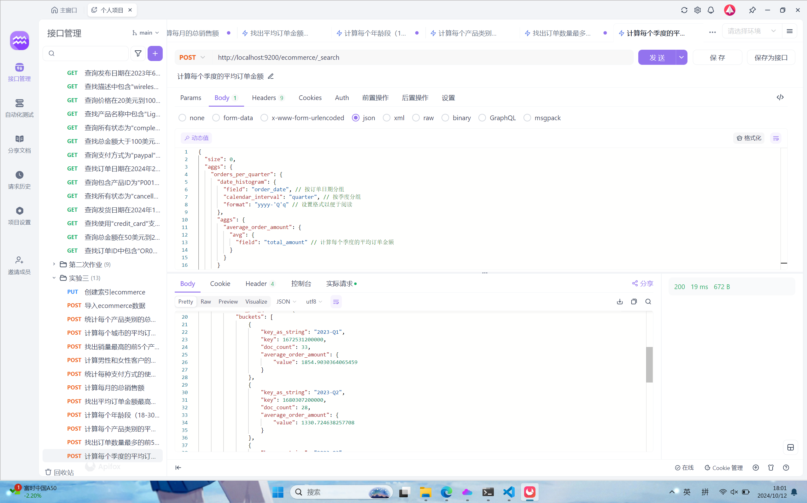

### 12.统计每个产品类别中的商品数量。

```
{
  "size": 0,
  "aggs": {
"product_count_by_category": {
  "terms": {
    "field": "product_category", // 按产品类别分组
    "size": 10 // 可以根据需要调整返回的类别数量
  }
}
  }
}
```

size: 0：表示不返回具体的文档，只返回聚合结果。
terms 聚合：根据 product_category 字段对商品进行分组。
field：指定要聚合的字段，这里是 product_category。
size：设置返回的类别数量。


### 13.计算男性和女性客户的平均订单金额。

```
{
  "size": 0,
  "aggs": {
"average_order_amount_by_gender": {
  "terms": {
    "field": "customer_gender" // 按客户性别分组
  },
  "aggs": {
    "average_total_amount": {
      "avg": {
        "field": "total_amount" // 计算平均订单金额
      }
    }
  }
}
  }
}
```

size: 0：表示不返回具体的文档，只返回聚合结果。
terms 聚合：根据 customer_gender 字段对客户进行分组。
average_total_amount：在每个性别组内计算 total_amount 字段的平均值。
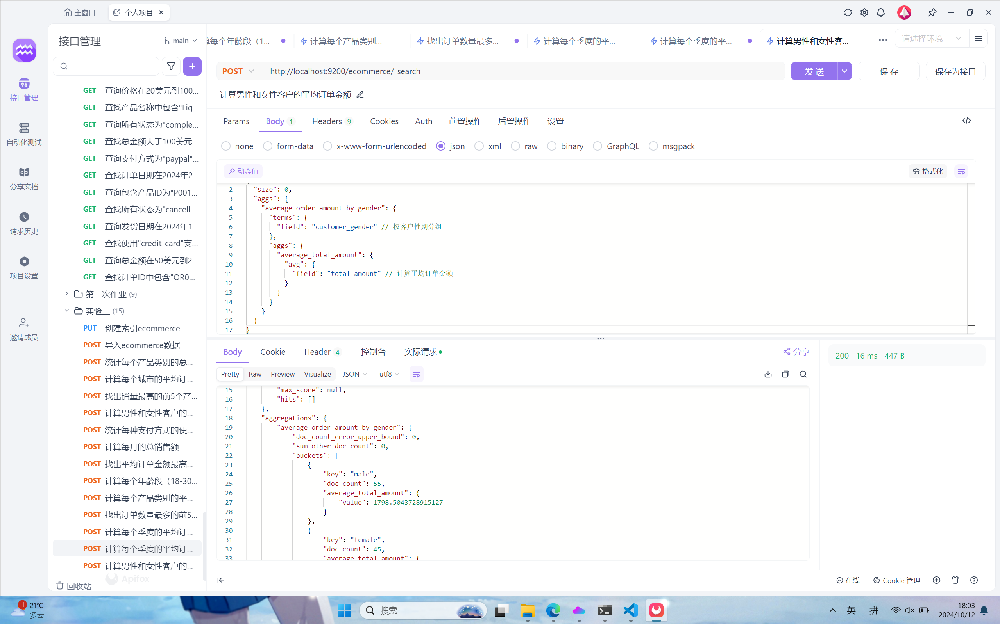

### 14.找出总销售额最高的前10个日期。

```
{
  "size": 0,
  "aggs": {
"sales_by_date": {
  "date_histogram": {
    "field": "order_date", // 按订单日期分组
    "calendar_interval": "day" // 按天聚合
  },
  "aggs": {
    "total_sales": {
      "sum": {
        "field": "total_amount" // 计算总销售额
      }
    },
    "top_dates": {
      "bucket_sort": {
        "sort": [
          {
            "total_sales": {
              "order": "desc" // 按总销售额降序排序
            }
          }
        ],
        "size": 10 // 限制结果为前10个
      }
    }
  }
}
  }
}
```

size: 0：表示不返回具体的文档，只返回聚合结果。
date_histogram 聚合：根据 order_date 字段对销售额按日期分组。
total_sales 聚合：计算每个日期的总销售额。
bucket_sort 聚合：对日期的总销售额进行降序排序，并限制结果为前10个。


### 15.计算每个季度销售额最高的产品类别。

```
{
  "size": 0,
  "aggs": {
"sales_by_quarter": {
  "date_histogram": {
    "field": "order_date",
    "calendar_interval": "quarter" // 按季度聚合
  },
  "aggs": {
    "sales_by_category": {
      "terms": {
        "field": "product_category",
        "size": 10 // 根据需要设置返回的类别数量
      },
      "aggs": {
        "total_sales": {
          "sum": {
            "field": "total_amount" // 计算每个类别的总销售额
          }
        },
        "top_categories": {
          "bucket_sort": {
            "sort": [
              {
                "total_sales": {
                  "order": "desc" // 按总销售额降序排序
                }
              }
            ],
            "size": 1 // 限制结果为每个季度的前1个类别
          }
        }
      }
    }
  }
}
  }
}
```

size: 0：表示不返回具体的文档，只返回聚合结果。
date_histogram 聚合：根据 order_date 字段对数据按季度进行分组。
terms 聚合：计算每个季度内各产品类别的销售额。
total_sales 聚合：计算每个产品类别的总销售额。
bucket_sort 聚合：对每个季度的产品类别总销售额进行降序排序，并限制结果为每个季度的前1个产品类别。
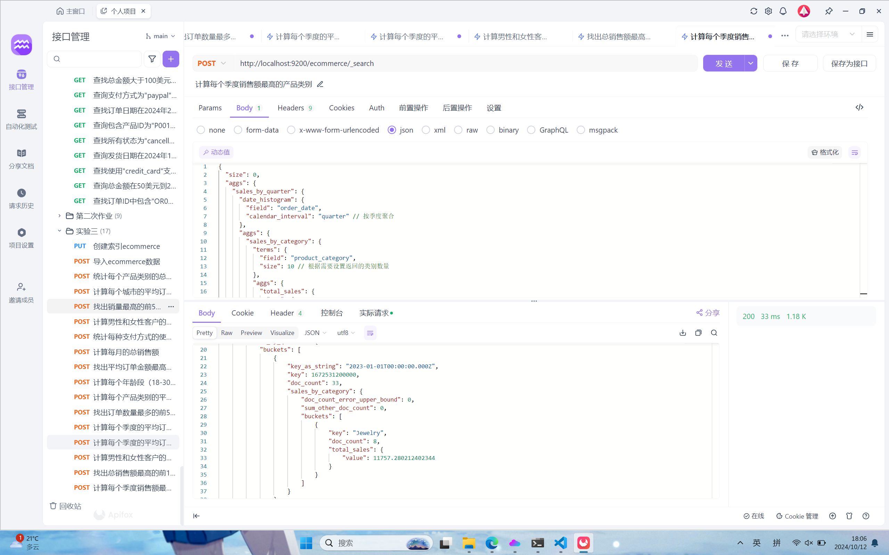

### 16.计算每天的订单数量，并显示7天移动平均值。

```
{
  "size": 0,
  "aggs": {
    "daily_orders": {
      "date_histogram": {
        "field": "order_date",
        "calendar_interval": "day"  // 按天聚合
      },
      "aggs": {
        "order_count": {
          "value_count": {
            "field": "order_id"  // 计算每天的订单数量
          }
        },
        "moving_average": {
          "moving_fn": {
            "buckets_path": "order_count",  // 计算移动平均
            "window": 7,  // 设置窗口为7天
            "script": "MovingFunctions.unweightedAvg(values)"  // 使用简单的移动平均
          }
        }
      }
    }
  }
}
```


### 17.比较本月销售额与上月销售额的差异。

```
{
  "size": 0,
  "aggs": {
    "monthly_sales": {
      "date_histogram": {
        "field": "order_date",
        "calendar_interval": "month"  // 按月分组
      },
      "aggs": {
        "total_sales": {
          "sum": {
            "field": "total_amount"  // 计算每月的总销售额
          }
        },
        "sales_difference": {
          "derivative": {
            "buckets_path": "total_sales",  // 计算销售额的差异
            "unit": "month"  // 基于月度
          }
        }
      }
    }
  }
}
```

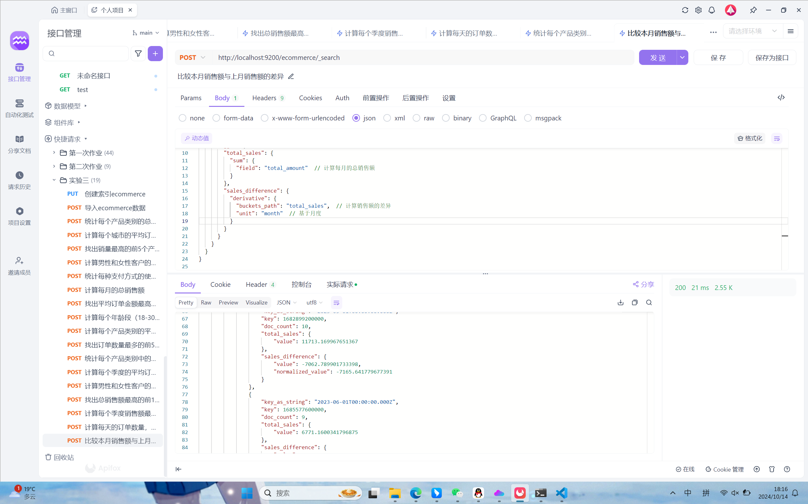

## 问题及解决办法

### 1.查询语法错误

解决办法：仔细检查查询的每一部分，确保使用正确的字段名称和聚合类型。使用 JSON 验证工具确认查询结构的正确性。

### 2.聚合类型不支持

解决办法：查阅 Elasticsearch 的官方文档，确认当前版本支持的聚合类型并使用正确的替代品（例如，使用 moving_fn 替代 moving_avg）。

### 3.数据类型不匹配

解决办法：确认索引中字段的数据类型，确保在聚合时使用的函数与数据类型相兼容。