# 《 实验五：Kibana 操作》


> 学院：省级示范性软件学院
> 课程：高级数据库技术与应用
> 题目：《 实验五：Kibana 操作》
> 姓名：李穗杰
> 学号：1977000019
> 班级：软工2201
> 日期：2024-11-11
> 实验环境： elasticsearch-8.12.2、apifox、Kibana-8.12.2
> 实验目的：熟练掌握Kibana操作
> 实验内容：Kibana操作练习

## 前期准备
在安装好kibana之后，点击数据视图，建立新的视图“实验五”，将其关联到实验三的ecommerce索引。
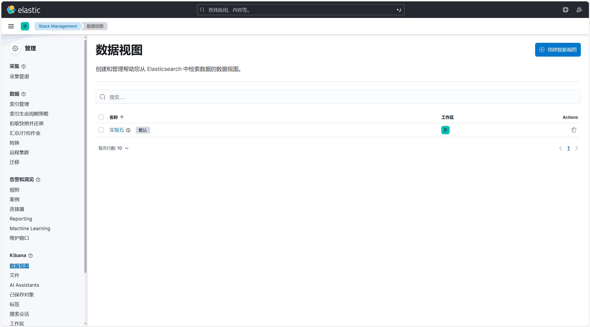
之后点击Analytics的Visualize Library，在其中就可以创建各式各样的视图
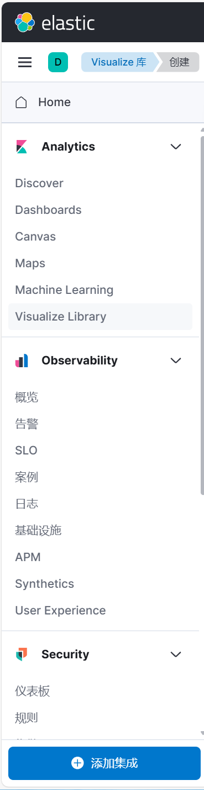

## 针对实验三的查询做出相应可视化数据
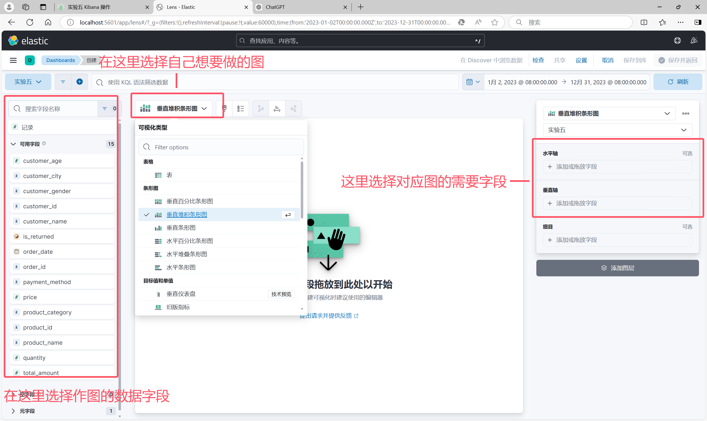
作图的方法如上图，首先考虑题目来选择自己需要什么类型的图，选择之后，把所需数据字段拖到相应的X，Y轴位置，生成好之后点击右上角的保存并返回即可放入仪表盘。
### 1.统计每个产品类别的总销售额
```
{
  "size": 0, 
  "aggs": {
    "sales_by_category": {
      "terms": {
        "field": "product_category",
        "size": 10
      },
      "aggs": {
        "total_sales": {
          "sum": {
            "field": "total_amount"
          }
        }
      }
    }
  }
}
```

根据此查询中使用到的字段，来作图。
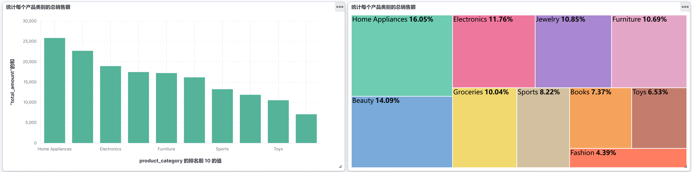
如图利用了柱状图以及树状图显示出了按照产品类别来聚合后，统计出的销售总额，需将total_amount求和后显示才能正确表达题意。
x轴为产品类别，y轴为总销售额。

### 2.计算每个城市的平均订单金额
```
{
  "size": 0,
  "aggs": {
    "avg_order_amount_by_city": {
      "terms": {
        "field": "customer_city",
        "size": 10
      },
      "aggs": {
        "average_order_amount": {
          "avg": {
            "field": "total_amount"
          }
        }
      }
    }
  }
}
```

根据此查询中使用到的字段，来作图。
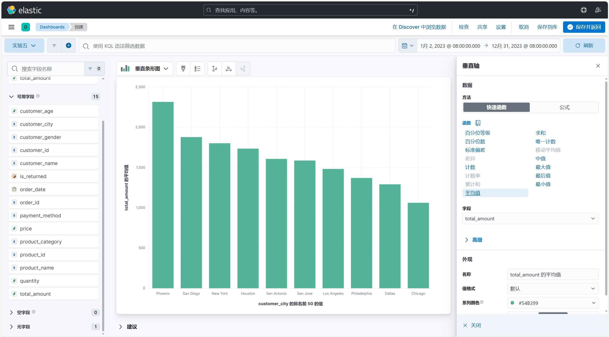
统计平均值只需在创建面板时在垂直轴的数据选项中选择平均值即可。
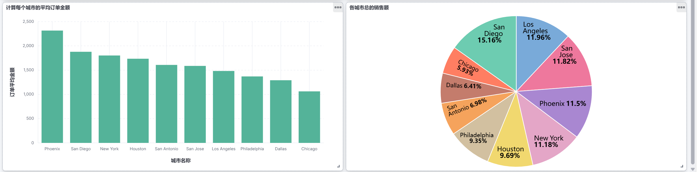
左边是每个城市的平均订单金额，右边是各城市总销售，可以看出，Phoenix的平均销售额最高，但是这个城市的总销售额排名第四，说明这个城市的销售市场虽然小，但是消费质量高。
### 3.找出销量最高的前5个产品
```
{
  "size": 0,
  "aggs": {
 "top_5_products_by_sales": {
   "terms": {
     "field": "product_name",    // 按产品名称分组
     "order": {
       "total_sales": "desc"     // 按销量总和降序排列
     },
     "size": 5                   // 限制返回前5个
   },
   "aggs": {
     "total_sales": {
       "sum": {
         "field": "quantity"     // 对销量字段求和
       }
     }
   }
 }
  }
}
```

根据此查询中使用到的字段，来作图。
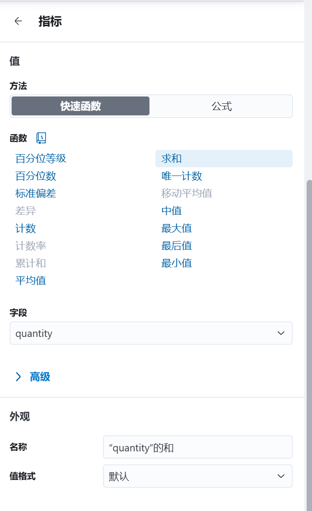
需要注意的是在设定指标quantity时，要选择为和，因为是查看销售量的和。
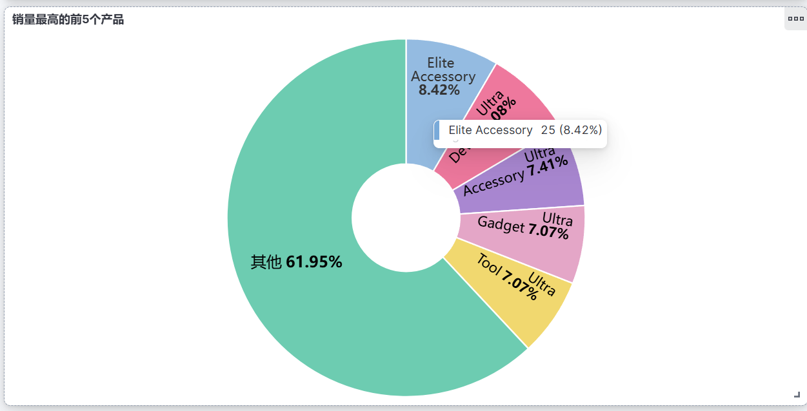
通过此图不仅可以清晰地看到销售量前五高的产品是什么，而且可以看到他们销售量的比例，如鼠标悬浮在对应扇形上，可查看该产品的销售量具体是多少


### 4.计算男性和女性客户的平均年龄
```
{
  "size": 0,
  "aggs": {
    "gender_avg_age": {
      "terms": {
        "field": "customer_gender"
      },
      "aggs": {
        "avg_age": {
          "avg": {
            "field": "customer_age"
          }
        }
      }
    }
  }
}
```

根据此查询中使用到的字段，来作图。
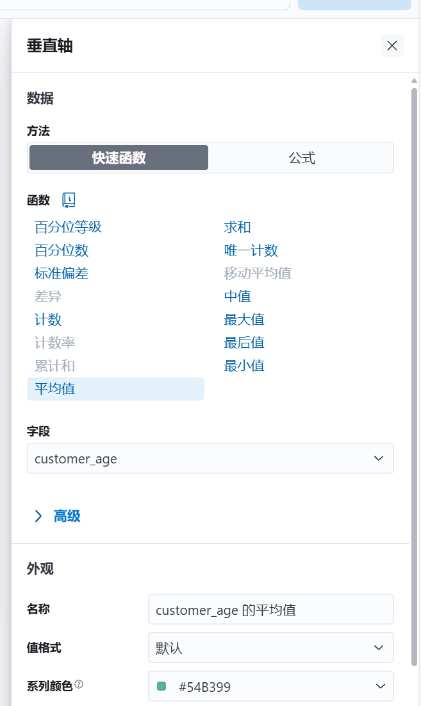
因为是求客户的平均年龄，所以在选纵坐标是要选择平均值。横坐标就选择客户的性别。
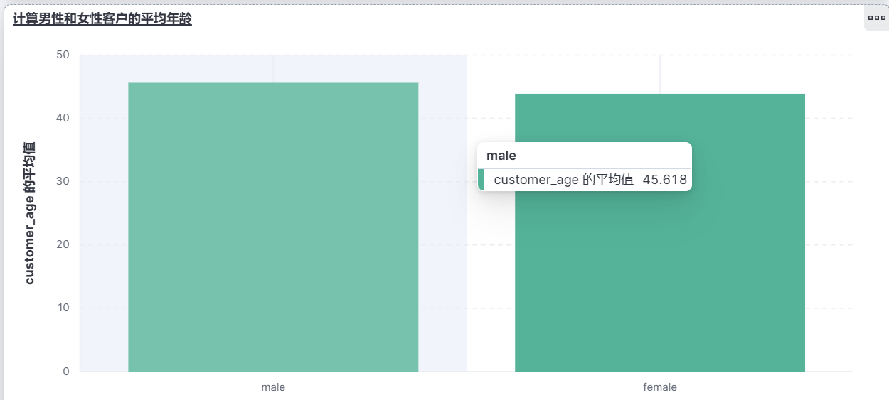
如图清晰看出按性别划分后的平均年龄。

### 5.统计每种支付方式的使用次数和总金额
```
{
  "size": 0,
  "aggs": {
    "payment_method_stats": {
      "terms": {
        "field": "payment_method", // 按支付方式分组
        "size": 10 // 限制返回的支付方式数量
      },
      "aggs": {
        "usage_count": {
          "value_count": {
            "field": "order_id" // 计算每种支付方式的使用次数
          }
        },
        "total_amount": {
          "sum": {
            "field": "total_amount" // 计算每种支付方式的总金额
          }
        }
      }
    }
  }
}
```

根据此查询中使用到的字段，来作图。
需要注意的就是在作图时使用次数需要用计数，看使用了几次，而总金额使用求和来得到他们的总金额。
在仪表盘中放两个图来完成这道题。
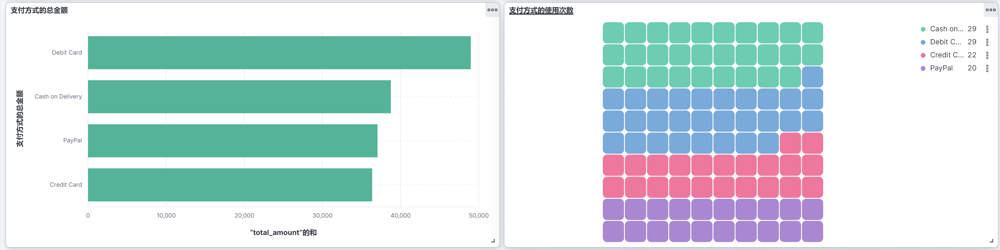

### 6.计算每月的总销售额
```
{
  "size": 0,
  "aggs": {
    "monthly_sales": {
      "date_histogram": {
        "field": "order_date", // 按照订单日期分组
        "calendar_interval": "month", // 按月分组
        "format": "yyyy-MM" // 设置日期格式
      },
      "aggs": {
        "total_sales": {
          "sum": {
            "field": "total_amount" // 计算每月的总销售额
          }
        }
      }
    }
  }
}
```

根据此查询中使用到的字段，来作图。
对于横坐标选择order_date，并在DATA HISTOGRAM中选择时间间隔为月。
对于纵坐标则是设置为total_amount的求和，就可以看到按照月来划分的总销售额
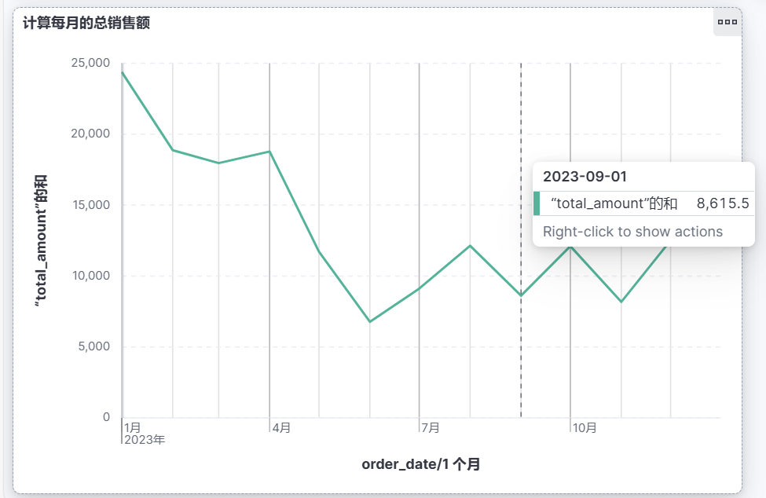

### 7.找出平均订单金额最高的前3个客户
```
{
  "size": 0,
  "aggs": {
    "top_customers": {
      "terms": {
        "field": "customer_id", // 按客户ID分组
        "size": 3 // 返回前3个客户
      },
      "aggs": {
        "average_order_amount": {
          "avg": {
            "field": "total_amount" // 计算平均订单金额
          }
        }
      }
    }
  }
}
```

根据此查询中使用到的字段，来作图。
对于此题，使用柱状图。横坐标为客户姓名，前选择展示最高的3条数据。
横坐标选择total_amount字段的平均值来满足题意，还可以看到kibana帮助我们把其他用户的平均消费金额也计算出来了。
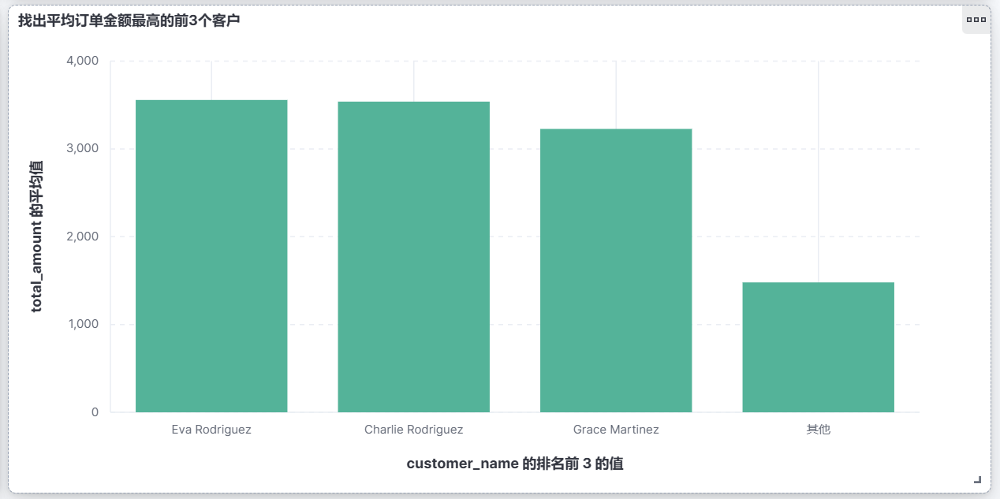

### 8.计算每个年龄段（18-30，31-50，51+）的客户数量
```
{
  "size": 0,
  "aggs": {
    "age_ranges": {
      "range": {
        "field": "customer_age", // 按客户年龄字段进行分组
        "ranges": [
          { "to": 30, "key": "18-30" }, // 18-30岁
          { "from": 31, "to": 50, "key": "31-50" }, // 31-50岁
          { "from": 51, "key": "51+" } // 51岁及以上
        ]
      }
    }
  }
}
```

根据此查询中使用到的字段，来作图。
因为要将年龄分段，所以用柱状图来完成本题目，横坐标为按照下图划分的年龄段。
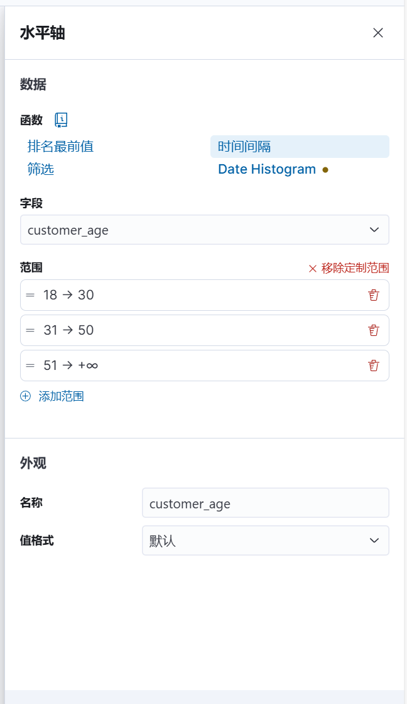
纵坐标则是将客户按照年龄段来计数查看客户数量。
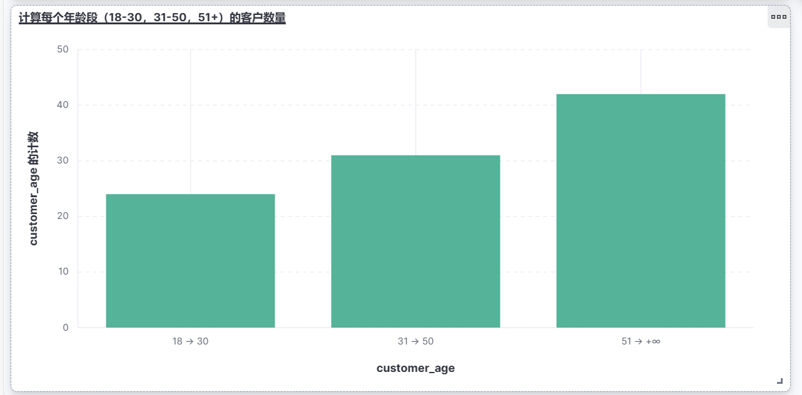
### 9.计算每个产品类别的平均单价
```
{
  "size": 0,
  "aggs": {
    "avg_price_by_category": {
      "terms": {
        "field": "product_category" // 按产品类别分组
      },
      "aggs": {
        "average_price": {
          "avg": {
            "field": "price" // 计算每个类别的平均单价
          }
        }
      }
    }
  }
}
```

根据此查询中使用到的字段，来作图。
本题使用柱状图，并且操作比较简单设置price为平均值即可
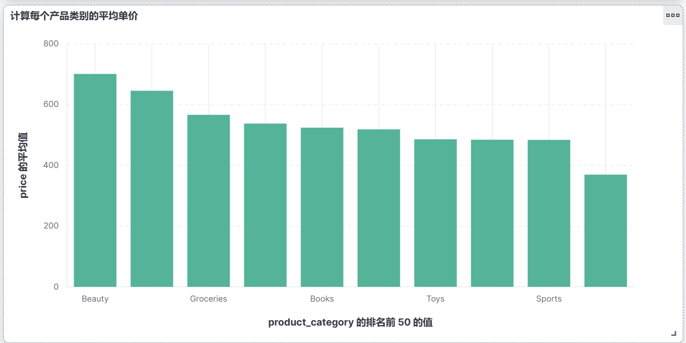

### 10.找出订单数量最多的前5个城市
```
{
  "size": 0,
  "aggs": {
    "top_cities": {
      "terms": {
        "field": "customer_city", // 按城市分组
        "size": 5 // 返回前5个城市
      }
    }
  }
}
```

根据此查询中使用到的字段，来作图。
因为对order_id计数即可得到订单数量，所以横坐标选择城市，纵坐标许纳泽order_id的计数，即可完成题目。
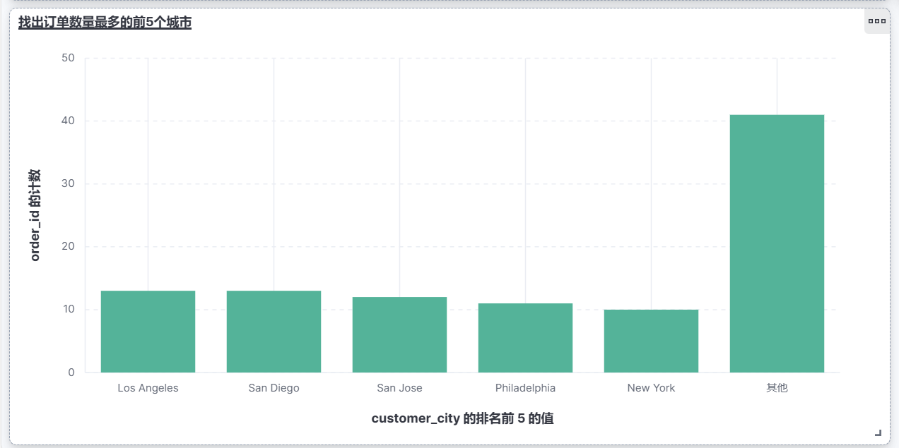

## 总结与思考

1. **掌握了Kibana的可视化和聚合查询功能**  
   - 通过实验，我熟练掌握了在Kibana中执行聚合查询，并使用其内置工具进行数据可视化。

2. **理解了常用的聚合操作**  
   - 学会了使用`terms`聚合来按字段分组，`sum`、`avg`、`value_count`等聚合方法来计算总和、平均值和计数等。

3. **根据业务需求选择合适的图表类型**  
   - 使用柱状图、饼图、折线图等不同图表，根据数据的特性（如时间序列、类别分布）选择合适的展示方式。

4. **深入了解Elasticsearch的查询机制**  
   - 在执行聚合查询时，掌握了如何利用Elasticsearch的强大查询能力来提取所需数据，并对其进行处理和分析。

5. **应对不同数据类型的聚合挑战**  
   - 在实验中，我注意到不同数据类型（如数值、字符串、日期）的聚合处理方式不同，需要根据字段类型选择合适的聚合函数。

6. **增强了数据分析和优化能力**  
   - 通过实践，我增强了对大数据的聚合和分析能力，并理解了如何优化查询以提高数据展示效果和查询效率。

7. **图表设计的直观性与易读性**  
   - 在进行数据可视化时，学会了如何设计更直观、更具可读性的图表，帮助快速理解和分析数据。

8. **未来**  
   - 对Kibana的进一步应用充满信心，他比很多其他可视化工具更方便更好用。
