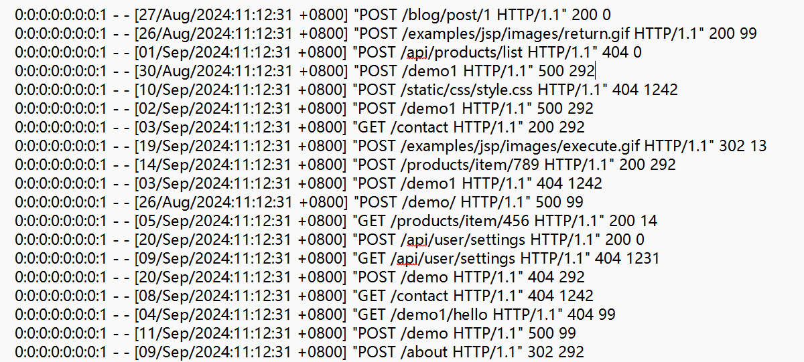
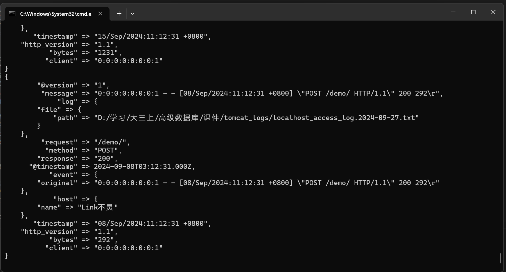
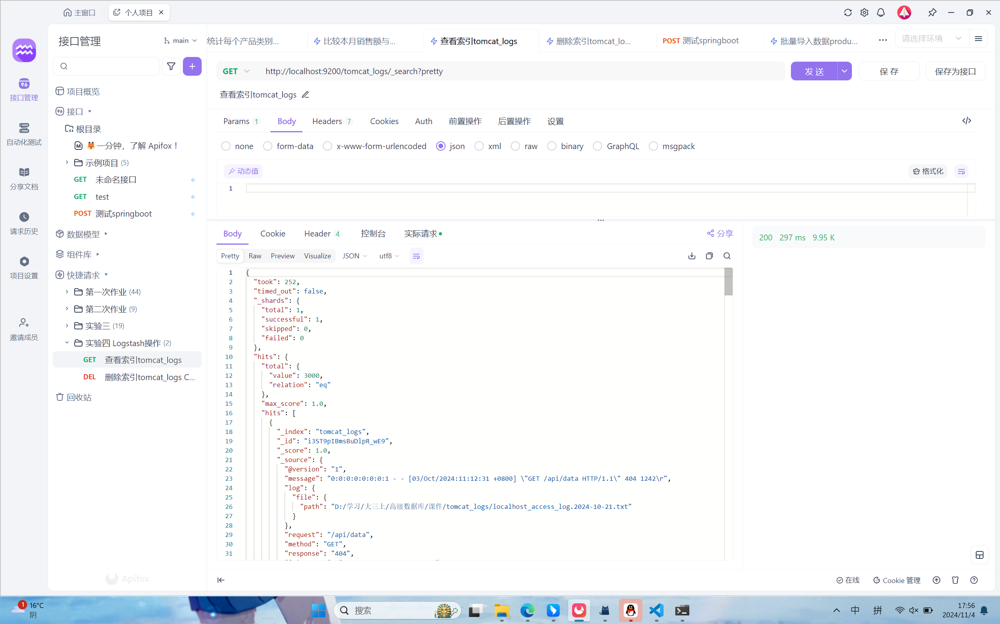
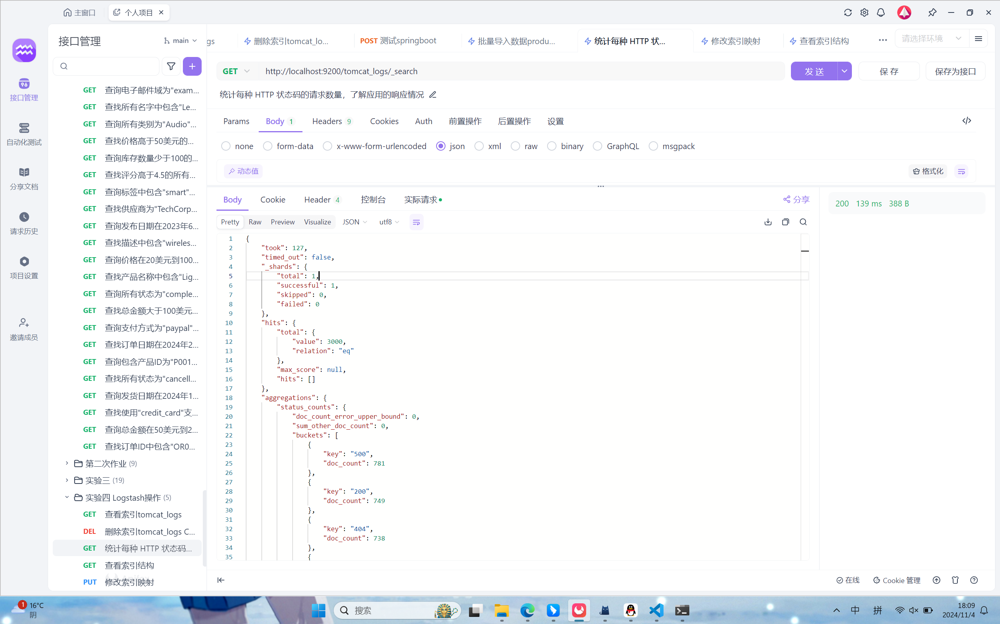
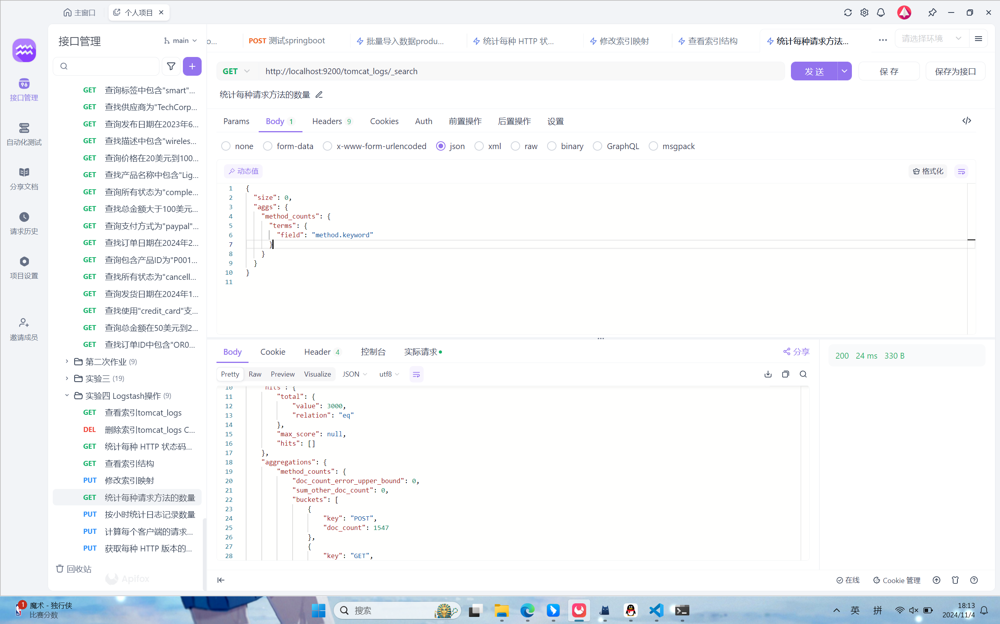
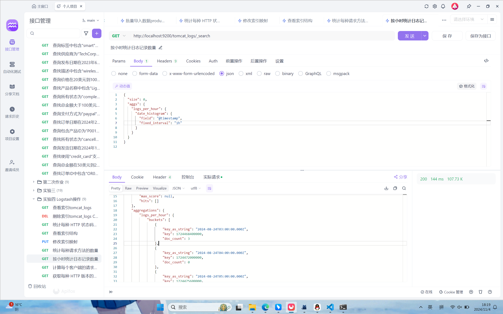
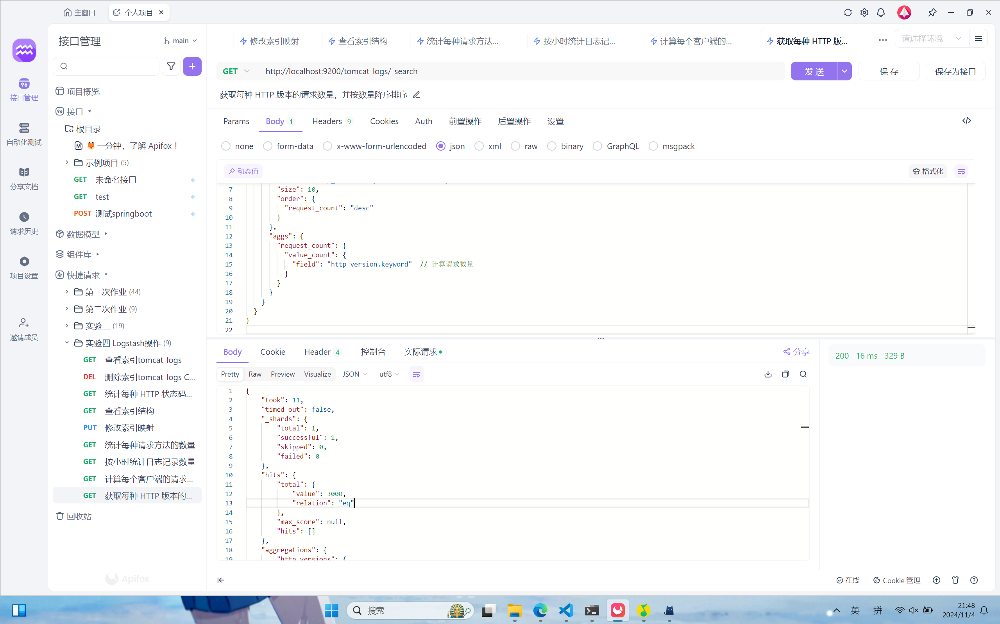
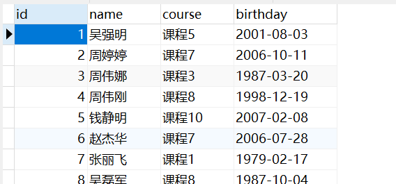
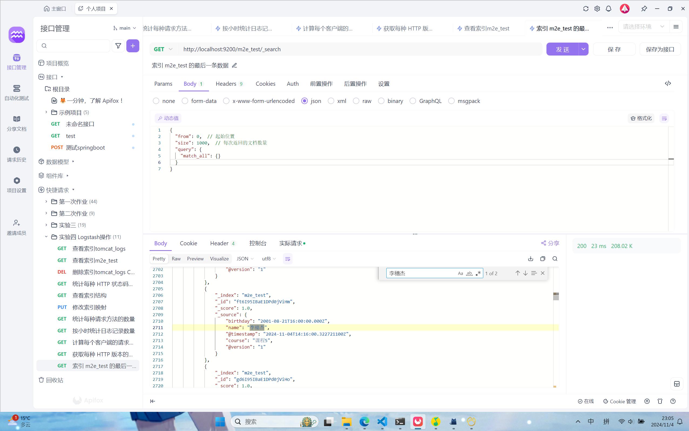

# 《 实验四 Logstash操作》


> 学院：省级示范性软件学院
> 课程：高级数据库技术与应用
> 题目：《 实验四 Logstash操作》
> 姓名：李穗杰
> 学号：1977000019
> 班级：软工2201
> 日期：2024-11-5
> 实验环境： elasticsearch-8.12.2、apifox、logstash
> 实验目的：熟练掌握logstash技术
> 实验内容：logstash操作练习

## 前期准备

分析老师给的日志文件，为接下来的配置文件test.conf理清思路。
可以使用grok，它是 Logstash 中用于解析和结构化日志的插件。它使用正则表达式来匹配文本并将其分解为结构化数据。

## 1.1tomcat日志处理

### 编辑配置文件test.conf
```
test.conf
input {
    file {
        path => "D:/学习/大三上/高级数据库/课件/tomcat_logs/*.txt"
        start_position => "beginning"
        sincedb_path => "NUL"
    }
}

filter {
  grok {
    match => { "message" => "%{IPV6:client} - - \[%{HTTPDATE:timestamp}\] \"%{WORD:method} %{URIPATH:request} HTTP/%{NUMBER:http_version}\" %{NUMBER:response} (?:%{NUMBER:bytes}|-)" }
  }
  date {
    match => ["timestamp", "dd/MMM/yyyy:HH:mm:ss Z"]
    target => "@timestamp"
  }
}

output {
    elasticsearch {
        hosts => ["http://localhost:9200"]
        index => "tomcat_logs"
    }
    stdout { codec => rubydebug }
}
```

#### 1.Input

input：定义数据的来源。在这里，使用的是 file 插件来从文件中读取数据。
path：指定要读取的文件路径。这里的路径是 D:/学习/大三上/高级数据库/课件/tomcat_logs/*.txt，表示读取该目录下所有的 .txt 文件。
start_position：指定读取文件的起始位置。在这里，beginning 表示从文件的开头开始读取。
sincedb_path：用于跟踪读取文件的进度。将其设置为 NUL，表示不存储进度信息，这样每次运行 Logstash 时都会从头开始读取文件。

#### 2.Filter

filter：用于处理和转换输入数据。在这里使用了 grok 和 date 两个过滤器。
grok：用于解析和提取字段。match 部分定义了如何解析日志消息（message），具体解析如下：
%{IPV6:client}：匹配 IPv6 地址，存储到 client 字段。

- -：字面匹配两个短横线，表示不相关的部分。
\\[%{HTTPDATE:timestamp}\\]：匹配时间戳，使用方括号和 HTTPDATE 模式，存储在 timestamp 字段。
\"%{WORD:method} %{URIPATH:request} HTTP/%{NUMBER:http_version}\"：匹配 HTTP 方法、请求路径和 HTTP 版本，分别存储到 method、request 和 http_version 字段。
%{NUMBER:response}：匹配响应状态码，存储到 response 字段。
(?:%{NUMBER:bytes}|-)：匹配字节数，如果没有则匹配短横线，非捕获组。
date：用于解析时间戳并转换为标准的 UTC 时间格式。
match 指定要解析的字段（timestamp）及其格式（dd/MMM/yyyy:HH:mm:ss Z）。
target 指定将解析后的时间戳存储在 @timestamp 字段中，Logstash 和 Elasticsearch 使用这个字段来处理事件的时间顺序。

#### 3.Output

output：定义数据的去向。在这里，数据被输出到 Elasticsearch 和标准输出（控制台）。
elasticsearch：
hosts：指定 Elasticsearch 的地址，这里是 http://localhost:9200。
index：指定将数据存储到哪个索引中，这里是 tomcat_logs。
stdout { codec => rubydebug }：将数据输出到控制台，以 rubydebug 编码格式显示。这对于调试非常有用，可以查看 Logstash 处理后的数据结构。

#### 4.测试

在cmd中使用命令：bin\logstash -f D:\学习\大三上\高级数据库\作业\logstash\test.conf

从结果能看到，已经按照预定效果创造索引。

在apifox中查看导入效果

发现成功导入。

### 在elasticsearch中做5个日志相关的分析
#### 1.按 HTTP 状态码统计请求数量

通过语句查询后，得到结果

```
{
    "took": 127,
    "timed_out": false,
    "_shards": {
        "total": 1,
        "successful": 1,
        "skipped": 0,
        "failed": 0
    },
    "hits": {
        "total": {
            "value": 3000,
            "relation": "eq"
        },
        "max_score": null,
        "hits": []
    },
    "aggregations": {
        "status_counts": {
            "doc_count_error_upper_bound": 0,
            "sum_other_doc_count": 0,
            "buckets": [
                {
                    "key": "500",
                    "doc_count": 781
                },
                {
                    "key": "200",
                    "doc_count": 749
                },
                {
                    "key": "404",
                    "doc_count": 738
                },
                {
                    "key": "302",
                    "doc_count": 732
                }
            ]
        }
    }
}
```

通过返回结果可以分析出：
响应状态分布：
500（内部服务器错误）: 781 次请求，比例较高，可能表明服务器存在一些问题或错误需要排查。
200（成功）: 749 次请求，表示有相当数量的请求成功处理，这是正常的状态。
404（未找到）: 738 次请求，说明有不少请求访问了不存在的资源，这可能需要检查 URL 的有效性或资源是否存在。
302（临时重定向）: 732 次请求，显示有相对较多的请求被重定向，可能需要确认重定向的配置是否合理。
流量及性能问题：

从状态码的分布来看，500 和 404 状态的数量较高，可能影响用户体验。我需要进一步分析这些请求的原因，找出问题所在。了解用户在使用系统时可能遇到的问题，进而优化系统的响应和处理能力。
#### 2.按请求方法统计请求数量


```
{
    "took": 13,
    "timed_out": false,
    "_shards": {
        "total": 1,
        "successful": 1,
        "skipped": 0,
        "failed": 0
    },
    "hits": {
        "total": {
            "value": 3000,
            "relation": "eq"
        },
        "max_score": null,
        "hits": []
    },
    "aggregations": {
        "method_counts": {
            "doc_count_error_upper_bound": 0,
            "sum_other_doc_count": 0,
            "buckets": [
                {
                    "key": "POST",
                    "doc_count": 1547
                },
                {
                    "key": "GET",
                    "doc_count": 1453
                }
            ]
        }
    }
}
```

通过这个返回结果，分析出：
请求方法分布：
POST 请求：1547 次，占比较高，说明用户主要通过 POST 方法与服务器进行交互。POST 通常用于提交数据，例如表单提交或上传文件。
GET 请求：1453 次，说明还有相当数量的请求是通过 GET 方法进行的，通常用于获取资源或数据。
行为分析：
由于 POST 请求数量高于 GET 请求，可能表示在进行数据提交、表单处理等操作。这可能是应用的核心功能，需确保这些请求的处理是高效且可靠的。
性能优化方向：
关注 POST 请求的性能，确保服务器能够有效处理大量数据提交。如果处理 POST 请求的响应时间过长，可能会影响用户体验。
也可以考虑分析 GET 请求的具体路径，找出用户最常访问的资源，优化这些资源的加载速度。

#### 3.计算每小时的请求数量

结果如图所示(因数据过多就不展示)，通过这条分析可以看出应用主要工作时间段，通过这个时间段，我们可以更精确的查找到各时间段业务需求，用以针对性的进行业务分析，增强系统效率。

#### 4.获取响应时间超过特定阈值的请求


```
{
    "took": 29,
    "timed_out": false,
    "_shards": {
        "total": 1,
        "successful": 1,
        "skipped": 0,
        "failed": 0
    },
    "hits": {
        "total": {
            "value": 3000,
            "relation": "eq"
        },
        "max_score": null,
        "hits": []
    },
    "aggregations": {
        "client_counts": {
            "doc_count_error_upper_bound": 0,
            "sum_other_doc_count": 0,
            "buckets": [
                {
                    "key": "0:0:0:0:0:0:0:1",
                    "doc_count": 3000
                }
            ]
        }
    }
}
```

通过返回结果我们能看出聚合结果，在 client_counts 聚合中，只有一个桶（bucket），key 值为 0:0:0:0:0:0:0:1，文档计数为3000。这表明所有3000条记录都与这个特定的 key 相关联。
含义：
key 值 0:0:0:0:0:0:0:1 一个特定的客户端标识符或地址，所有3000条记录都是由这个客户端生成的。如果该 key 代表的是一个特定的客户端或设备，这意味着该客户端的活动在这段时间内非常频繁，所有文档都是与之相关的。

#### 5.按客户端 IP 统计请求数量


```
{
    "took": 11,
    "timed_out": false,
    "_shards": {
        "total": 1,
        "successful": 1,
        "skipped": 0,
        "failed": 0
    },
    "hits": {
        "total": {
            "value": 3000,
            "relation": "eq"
        },
        "max_score": null,
        "hits": []
    },
    "aggregations": {
        "http_versions": {
            "doc_count_error_upper_bound": 0,
            "sum_other_doc_count": 0,
            "buckets": [
                {
                    "key": "1.1",
                    "doc_count": 3000,
                    "request_count": {
                        "value": 3000
                    }
                }
            ]
        }
    }
}
```

通过分析日志发现访问的客户端都是同一个，访问了3000次，通过该查询可以查看到访问客户端的情况，在更复杂的数据中，能产生更加有用的数据，清楚更重要的客户端是哪一个。

## 1.2数据转换和传输
### 要求：

1. 将本地的mysql数据库中的一张表导入到本地的elasticsearch中。
2. 数据库表更新后，数据能够自动同步到elasticsearch中。

### 编写logstash配置文件test_jdbc.conf
```
input {
  jdbc {
    # JDBC 驱动程序的路径
    jdbc_driver_library => "D:\source\mysql-connector-j-9.1.0\mysql-connector-j-9.1.0.jar"
    
    # JDBC 驱动程序的类名
    jdbc_driver_class => "com.mysql.cj.jdbc.Driver"
    
    # 数据库连接字符串
    jdbc_connection_string => "jdbc:mysql://localhost:3306/teacher"
    
    # 数据库用户名
    jdbc_user => "root"
    
    # 数据库密码
    jdbc_password => "123456"
    
    # 要执行的 SQL 查询
    statement => "SELECT * FROM teacher "
    
    # 查询的时间间隔（例如，每分钟运行一次查询）
    schedule => "* * * * *"
    
    # 用于增量查询的字段
    use_column_value => true
    tracking_column => "updated_at"
    
    # 记录上次运行的时间戳
    last_run_metadata_path => "/path/to/last_run_metadata"
  }
}

filter {
  mutate {
    remove_field => [ "id" ]
  }
}

output {
  elasticsearch {
    hosts => ["http://localhost:9200"]
    index => "m2e_test"
  }
}
```

再下载了jdbc驱动后，将input的各项配置配置好，根据我数据库删除id字段，做一个简单的过滤。

之后输出到es，索引命名为m2e_test。在apifox中查看索引情况，发现创建成功


### 测试数据库表更新后，数据能够自动同步到elasticsearch中

先插入数据

成功查找到新增数据！

## 总结

> 在这次作业中，我们主要使用了 Elasticsearch 、lofstash 和 apifox 等工具来处理和查询大量的日志数据。在实验过程中，我设计并实施了以下几个核心任务：
>
> 数据导入： 通过  Logstash 工具，将数据（例如 Tomcat 日志）插入 Elasticsearch 中，并确保数据按期望格式存储。日志数据包括了多个字段，如请求时间、请求方法、响应码、IP 地址等。
>
> 数据查询与检索： 我们使用了 Elasticsearch 的查询功能进行数据的搜索和过滤。通过构造查询请求，我们可以快速定位符合条件的日志，帮助进行故障排查或分析用户行为。
>
> 数据聚合和分析： 在学习过程中，我们还利用了 Elasticsearch 的聚合功能，对日志数据进行了分类和汇总，例如计算各个 HTTP 状态码的分布、请求量的波动等。这些分析可以帮助我们更好地理解系统的运行状态。
>
> 遇到的挑战与问题： 我遇到了一些挑战，例如字段的类型选择不当导致查询失败（如 timestamp 字段默认是 text 类型），以及在进行数据聚合时遇到字段数据不一致等问题。但这些问题通过查看文档和调整配置文件逐一解决。
>

## 启发

> 通过这个作业，我深刻体会到了 Elasticsearch 在大规模数据查询与分析中的强大能力。以下是一些关键的启发：
>
> 数据模型的重要性： 在开始使用 Elasticsearch 之前，明确索引映射和字段类型的定义至关重要。错误的字段类型（如将时间戳字段定义为文本类型）会导致查询和聚合的失败。因此，构建良好的数据模型是高效使用 Elasticsearch 的基础。
>
> Elasticsearch 的高效性： Elasticsearch 在处理海量数据时的高效性给我留下了深刻的印象。其基于倒排索引的设计，能够快速检索出符合条件的数据，尤其是在进行全文搜索时。
>
> 数据聚合与分析的潜力： 使用 Elasticsearch 的聚合功能，可以轻松对数据进行统计和分析，帮助我提取出系统运行的关键指标。例如，统计每个请求的响应时间、分析请求频次等，能有效辅助运维和性能优化。
>
> 跨工具协作： 在作业中，我不仅使用了 Elasticsearch，还借助了 Logstash 等工具进行数据导入和预处理，这让我体会到了跨工具协作的重要性。Logstash 可以帮助我们从不同的日志文件中读取数据，并将其规范化后存储到 Elasticsearch 中，极大提高了工作效率。
>

## 学习方向

> 深入学习 Elasticsearch： 虽然我已经了解了 Elasticsearch 的基础功能，但对于更深层次的内容（如复杂查询、分布式架构、性能优化等）仍然需要进一步掌握。特别是在面对大规模数据时，如何调整配置，优化查询性能，是我需要继续深入研究的方向。
>
> 数据分析与机器学习： Elasticsearch 在大数据处理中的应用仅仅是一个开始，未来我希望能将其与数据分析、机器学习结合起来，进行更为复杂的数据挖掘和分析。例如，使用机器学习算法对日志数据进行异常检测，预测系统故障等。
>
> 日志管理与监控： 由于日志分析对企业运营至关重要，未来我还希望能够深入了解日志管理与监控系统的构建，尤其是在处理大规模、实时日志数据时，如何保证系统的高效性和稳定性。
>


